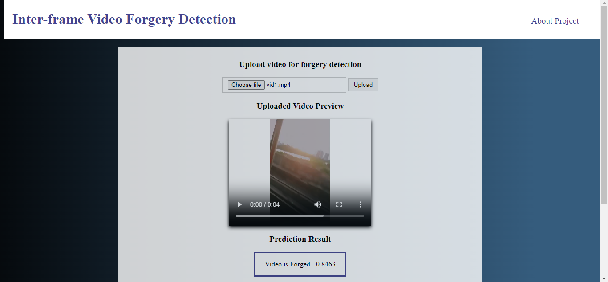

# Inter-frame Video Forgery Detection
In today's digital era, video content plays a crucial role in shaping public perception. However, advanced video editing techniques have made it easier to create deceptive videos for malicious purposes. The "Inter-frame Video Forgery Detection" project addresses this challenge by developing a system to detect inter-frame video forgeries like frame insertion and frame deletion. Using the Multi-Scale Difference Convolutional Neural Network (MSDCNN) combined with Long Short-Term Memory (LSTM) networks, the project extracts detailed features capturing both local and global variations across frames. This helps identify genuine temporal dynamics and detect synthetic alterations, preventing the spread of fraudulent media.

## Modules
1. Data Preprocessing
([preprocess.py](preprocess.py))
    - Frame extraction from input video
    - Grayscale conversion
    - Resize
2. Multi-scale Difference Feature Extraction
([difference_msdcnn.py](difference_msdcnn.py),[msdcnn.py](msdcnn.py))
    - Calculate Pixel Difference Features using Forward Differential Convolutional Neural Network
    - Calculate Deep Difference Features using Post Differential Convolutional Neural Network
    - Concatenate both features -> Multi-scale Difference Feature
3. Classification
([lstmFC.py](lstmFC.py),[vfd_main.py](vfd_main.py))
    - Classify the video as 'Forged' or 'Original' using the LSTM model

## Example
